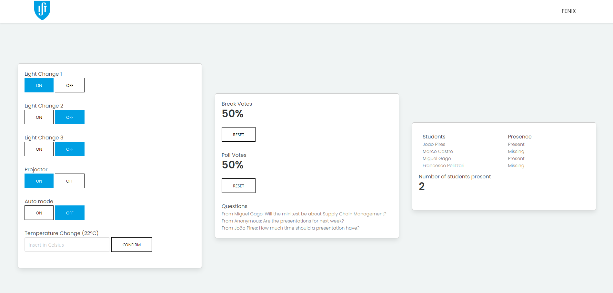
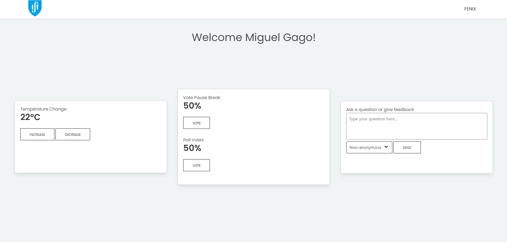

# Smart Classroom

Although typical classrooms already provide enough for better education, it is very possible to improve them even further by minimalizing any possible distractions, saving time in any non education related things and improving quality of study. With this, our solution is able to fulfill these aspects through the beauty of automation.

Within this file, you will find the general idea behind this project, as well as the full design and components that give the functionalities we want. After it, you can find the needed software requirements coupled with the instructions for installation and deployment.

## General Information

This project aims to reduce the time wasting actions through ways of automation, holding functionalities such as: automation in changing the environment aspects of the classroom, automatic filling of the attendance sheet for the teacher, the student's ability to give feedback and vote for environment changes and finally giving "admin" access to the teacher so they are able to change any of environment factors to their liking (being these last two supported by a web application).

## Built With

### Hardware

* [Raspberry Pi 4 Model B](https://www.raspberrypi.com/products/raspberry-pi-4-model-b/) - 1 unit - Development board for the actuators used
* [Arduino Starter Kit](https://store.arduino.cc/products/arduino-starter-kit-multi-language) - 1 unit - which contains various needed sensors and the development board for them
    * [Arduino Uno]() - 1 unit - development board for the sensors
    * [Alphanumeric LCD]() - 1 unit - displays real, simulated and ideal temperature
    * [Yellow LED]() - 6 units - shows the behavior of the classroom lights
    * [Red LED]() - 1 unit - shows the behavior of the projector
    * [Temperature Sensor]() - 2 units - captures the real temperature
    * [Phototransistor]() - 3 units - captures the ambience lighting
    * [Pushbuttons]() - 4 units - to show the location of a seated student

### Software

* [Raspberry Pi OS](https://www.raspberrypi.com/software/) - Operating system
    * [GPIO]() - Library
* [Python](https://www.python.org/) - Programming Language
    * [Flask]() - Library
* [Arduino/C++](https://www.arduino.cc/en/software) - Programming Language and Platform
* [HTML/CSS/Javascript]() - Programming Language behind the application

## Getting Started

### Assembly Instructions

The circuit consists of 2 different kinds of sections.
- The teacher section:<br>
    - Containing a light sensor connected to the arduino.
    
    - And 3 leds connected to the rasperry pi, 2 of them in parallel representing the room lights, and 1 representing the projector.<br>
    

- The student section:<br>
    - Containing a light sensor, a temperature sensor, and 2 buttons (to represent student seats).
    
    - And 2 leds connected in parallel to the raspberry pi, representing the room lights.
    

- There is also a 16x2 lcd display connected to the raspberry pi that is not attached to any of the sections:


For this project we will be using 1 teacher section, 2 student sections and 1 lcd display, but it's worth to mention that more sections can easily be added.
The arduino and raspberry pi should be connected through usb.
This project is meant to be run on the raspberry pi.


### Software Prerequisites

Python 3.10 or above is necessary.
This project makes use of the following python libraries:
- Flask - To run the frontend of our web application.
- argparse - To simplify the implementation of messages and commands.
- RPi.GPIO - To control the IO pins in the raspberry pi.
- RPLCD - To control the text written on the display.
- serial - For the communication between the arduino and the raspberry pi.

```
pip install Flask argparse RPi.GPIO RPLCD serial
```

### Installation

To run this project, all that needs to be done is to clone this repository and run the "app.py" script.

```
git clone git@github.com:JoaoPires02/Ambient-Intelligence-Project.git
```
```
cd Ambient-Intelligence-Project
```
```
python3 app.py
```

If everything is setup correctly, the link for the web application will be written in the console.


## Demo

Upon opening the app's link in the browser, the user is redirected to the log in screen:

Here, the user should type the room code, written in the lcd display and their identification number, being the student number for the students (example: '99090') or 't' for the teacher.


On the first line on the display the temperature is displayed in ºC with the following format: "real_temp / ideal_temp / sim_temp"

- real_temp: Average temperature of all sensors in the classroom.
- ideal_temp: Goal temperature.
- sim_temp: Simulated temperature (since we can't change the actual temperature detected by the sensors).

When logged in as the teacher, the user has many different options:
- Switch on and off the lights of each section.
- Turn on and off the automatic lights mode.
- Change the ideal temperature to a particular value.
- Reset the break and poll votes.
- Read student's questions.
- See the list of presences.


When logged in as a student, there are different options:
- Vote to increase or decrease the room temperature.
- Vote for a break.
- Vote for a poll.
- Ask a question that only the teacher can see.


## Deployment

The app is setup to work for any device in the local network.

## Additional Information

### Authors

* **João Pires** - *Controller/Parser* - [JoaoPires02](https://github.com/JoaoPires02)

* **Marco Castro** - *Controller/Parser* - [MarcoCastro0406](https://github.com/MarcoCastro0406)

* **Miguel Gago** - *FrontEnd* - [miguelgago13](https://github.com/miguelgago13)

### Versioning

Version 1.0.0
